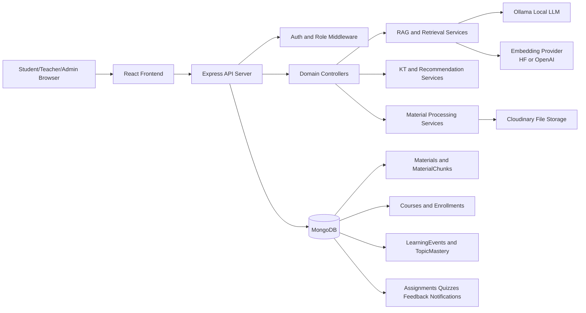
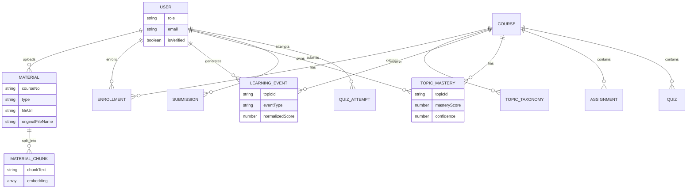
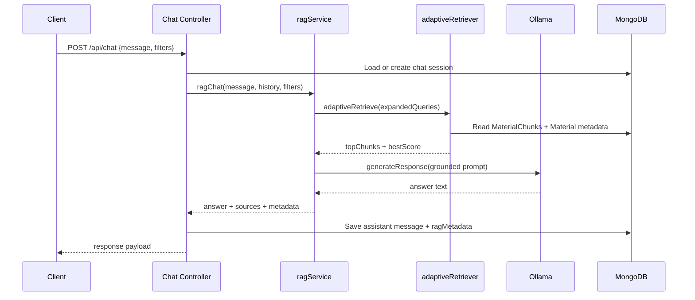

# SyncAcademy: Complete Project Summary

Date: 2026-04-24

## Executive Summary

SyncAcademy is a full-stack educational platform designed as an upgraded classroom system for KUET-style university workflows, combining standard LMS functions (auth, course management, enrollment, materials, assignments, quizzes, announcements, notifications) with AI-first capabilities (semantic search, RAG tutor, and knowledge-tracing-driven recommendations).

The implementation is production-oriented:
- Backend: Node.js + Express + MongoDB (Mongoose), modular controllers/services/routes.
- Frontend: React + MUI, role-based dashboards for student/teacher/admin.
- AI stack: embeddings + chunk retrieval for search, local LLM (Ollama) RAG chat, and KT analytics with Python model pipeline support.

---

## 1. Proposal and Problem Analysis

### 1.1 Problem Identification

The project targets a gap in traditional classroom platforms where students struggle with:
- Fast retrieval of relevant study materials across many uploads.
- Personalized academic support based on their weak topics.
- Continuous guidance beyond static file repositories.

From the codebase and planning docs, the primary problem statements are:
- Generic LMS tools provide storage and submissions, but not semantic content discovery.
- Learning support is not adaptive to mastery signals.
- Chat assistants often hallucinate if not grounded in course materials.

This project addresses those with:
- Semantic retrieval from uploaded documents (PDF/DOCX/PPTX).
- Grounded RAG tutoring constrained to uploaded context.
- Knowledge tracing and recommendation features based on learning events.

### 1.2 Literature/Method Review (Implementation-Aligned)

The repository applies modern approaches commonly used in educational AI systems:

1. Semantic Search and Dense Retrieval
- Embedding-based similarity with cosine scoring.
- Hybrid filtering: semantic score plus lexical overlap gating.
- Grouping chunk-level hits into material-level ranked outputs.

2. Retrieval-Augmented Generation (RAG)
- Query analysis and adaptive retrieval depth.
- Prompt grounding with strict context-only system rules.
- Optional self-evaluation loop (faithfulness/coverage) before final answer.

3. Knowledge Tracing and Prediction
- Baseline tabular models (logistic regression, XGBoost/fallback GBM).
- Sequence KT experiments (LSTM DKT, Transformer KT).
- Explainability artifacts and recommendation driver summaries.

4. Learning Analytics and Recommendation
- Topic mastery records from student learning events.
- Weak-topic extraction and material ranking by topic-tag overlap.
- Fallback recommendation mode for sparse-tag situations.

Note: The repository includes methodology templates and model-comparison templates, but does not currently include a formal citation bibliography file. The review above is therefore implementation-driven rather than paper-citation-driven.

### 1.3 Feasibility Analysis

Technical feasibility is high because core modules are already implemented end-to-end:
- Material ingestion and chunk embedding pipeline exists.
- Search, chat, KT endpoints, and role-based frontend routes are active.
- Automated tests exist for recommendation and KT utility layers.

Operational feasibility considerations:
- Requires MongoDB and environment configuration.
- Chat quality and latency depend on local Ollama model availability.
- Embedding provider can switch between Hugging Face and OpenAI by env settings.

Resource feasibility:
- Backend targets Node 18.x.
- ML training pipeline exists in Python scripts; can run smoke mode for fast validation.
- Suitable for a 2-person capstone team with phased delivery.

---

## 2. System Design

### 2.1 Architecture Overview

The system follows a layered web architecture:
- Presentation layer: React role-based dashboards and pages.
- API layer: Express routes + auth middleware + controllers.
- Domain/service layer: RAG, retrieval, embeddings, KT prediction/recommendation logic.
- Data layer: MongoDB collections for users/courses/materials/chunks/events/mastery/etc.
- External AI services: Ollama LLM and Hugging Face/OpenAI embeddings.

### 2.2 Methodology by Core Feature

1. Material Ingestion and Indexing
- Upload teacher/admin files.
- Extract text per file type (PDF/DOCX/PPTX).
- Save metadata and file URL.
- Chunk text and generate embeddings.
- Persist chunk vectors for retrieval.

2. Semantic Search
- Validate query quality.
- Embed query.
- Score chunk vectors with cosine similarity.
- Apply hybrid lexical-semantic gates.
- Aggregate by material and return relevance-ranked list.

3. AI Tutor (RAG)
- Analyze query complexity and type.
- Adaptive top-K retrieval with dynamic thresholds.
- Build strict grounded prompt.
- Generate answer from Ollama.
- Optionally self-evaluate and retry with expanded retrieval.

4. Knowledge Tracing and Recommendations
- Log learning events from quiz/assignment/material interactions.
- Build features and predict topic mastery.
- Store mastery/confidence and explanation metadata.
- Generate weak-topic-first material recommendations.

### 2.3 Data Model Snapshot (Simplified)

### 2.4 Request Flow Example (AI Tutor)

---

## 3. Implementation and Tool Usage

### 3.1 Technology Stack

Backend:
- Node.js 18.x, Express, Mongoose, JWT, bcrypt, multer.
- Cloudinary for file storage, nodemailer for email/OTP.
- OpenAI client + Hugging Face API for embeddings, Ollama for local LLM.

Frontend:
- React 18, React Router, Material UI, Axios, react-hot-toast.
- Context-based auth and theme handling.

ML/Analytics:
- Python training scripts for tabular and sequence KT models.
- Model registry/report folder conventions and evaluation templates.

### 3.2 Coding Implementation Highlights

1. Backend Modularity
- Clear split by route/controller/service/model.
- Controllers handle request/response and access control.
- Services encapsulate AI/business logic.

2. Reliability and Security Patterns
- Role-based route guards in backend and frontend.
- Query validation for semantic search and KT event payloads.
- Error handling with specific paths for file limits and AI downtime.

3. AI Engineering Practices
- Adaptive retrieval rather than static top-K.
- Context-only prompting with explicit fallback phrase.
- Optional self-eval loop for quality control.

4. Maintainability Features
- Shared constants for material types.
- Service-based frontend API wrappers.
- Scripted dataset export, model training, and reports.

### 3.3 Practical Tool Usage

Developer workflow uses:
- npm scripts for backend runtime and KT pipelines.
- Node built-in test runner for backend tests.
- CRA-based frontend runtime (with Vite config present, indicating migration/experiment artifact).

Cloud and local tooling:
- Cloudinary as persistent file host.
- Local Ollama for private/offline-capable tutoring.
- Hugging Face hosted inference for low-cost embeddings.

---

## 4. Testing and Evaluation

### 4.1 Verification Strategy (What is Tested)

Current automated tests focus on KT/recommendation core logic:
- Weak-topic extraction and recommendation ranking behavior.
- Feature engineering consistency for KT training rows.
- Data-quality diagnostics (null rates, duplicates, time anomalies).
- Explainability and mastery engine utility behavior.

This indicates strong algorithm-level unit verification for analytics modules.

### 4.2 Validation Strategy (How Correctness is Enforced)

1. API Input Validation
- Search query quality constraints.
- KT event schema validation (types, bounds, required fields).

2. Authorization Validation
- Protected routes with role checks.
- Recommendation access policy: self or admin.

3. Grounding Validation for AI Tutor
- Topic-relevance gate before answer generation.
- Confidence and fallback behavior when context is weak.

### 4.3 Performance and Quality Evaluation

Implemented evaluation pipeline supports:
- Time-aware train/validation/test split for KT.
- Baseline model comparison.
- Sequence model ablation and history-slice metrics.
- Calibration and subgroup analysis outputs.

Known performance strengths:
- Retrieval thresholds are complexity-aware.
- Search caps result size and matches per material.
- Chat timeout and graceful degradation for unavailable models.

Observed gaps (important for future validation):
- No repository-level benchmark report files committed yet (ml/reports not present).
- No end-to-end integration tests for full user journeys.
- No load/performance test scripts for API throughput under concurrent users.

### 4.4 Suggested Evaluation KPIs for Final Defense

Use these measurable targets in final experiments:
- Search relevance: Precision@5, nDCG@10.
- RAG quality: grounded answer rate, unsupported-claim rate.
- KT quality: AUC, PR-AUC, Brier score, calibration error.
- User outcomes: weekly weak-topic improvement and assignment score lift.
- System performance: p95 API latency for search and chat endpoints.

---

## 5. Teamwork and Project Management

To ensure fair workload and reduce bus-factor risk, use the following split:

1. Jony (Platform + Integrations)
- Authentication, role middleware, course/enrollment flows.
- Material ingestion/search endpoint maintenance.
- Deployment/environment ops and API integration support.

2. Niloy (AI + Analytics)
- RAG quality tuning and prompt/retrieval experiments.
- KT model training/evaluation and recommendation logic.
- Explainability outputs and experiment reporting.

3. Shared Responsibilities (must be joint)
- Test writing for critical workflows.
- Final report preparation and demo script.
- Bug triage and release readiness.

This distribution keeps each member with a primary domain while enforcing shared ownership on quality and delivery artifacts.

### 5.3 Progress Tracking Framework

Current evidence of progress tracking:
- Phase plan with explicit branch naming.
- Scripted commands for reproducible KT workflows.
- Experiment and model comparison templates in ML folder.

Recommended operational tracking enhancements:
- Weekly milestone board with Done/In-Progress/Blocked statuses.
- Issue-to-branch mapping per feature.
- Definition-of-done checklist per phase:
  - backend endpoints complete
  - frontend screens integrated
  - tests added
  - demo scenario validated

### 5.4 Risk and Mitigation in Management Terms

Primary risks:
- AI service availability (Ollama or embedding endpoint).
- Uneven feature ownership in a 2-person team.
- Last-minute integration regressions across many modules.

Mitigation:
- Keep rule-based and fallback responses active.
- Pair-review all critical merges.
- Freeze features before final demo; focus final sprint on regression and evaluation evidence.

---

## Codebase Evidence Map (Inspected Areas)

Core runtime and API wiring:
- backend/server.js

Search, RAG, and AI services:
- backend/controllers/searchController.js
- backend/controllers/chatController.js
- backend/services/ragService.js
- backend/services/adaptiveRetriever.js
- backend/services/embeddingServices.js
- backend/services/ollamaService.js

Materials and learning analytics:
- backend/controllers/materialController.js
- backend/controllers/knowledgeTracingController.js
- backend/services/ktModelService.js
- backend/services/recommendationService.js
- backend/models/materialModel.js
- backend/models/learningEventModel.js
- backend/models/topicMasteryModel.js

Frontend architecture and client integration:
- frontend/src/router/AppRouter.js
- frontend/src/context/AuthContext.js
- frontend/src/services/api.js
- frontend/src/pages/student/SearchMaterials.js
- frontend/src/pages/shared/AITutor.js

Testing and ML workflow docs:
- backend/tests/recommendationService.test.js
- backend/tests/ktFeaturePipeline.test.js
- backend/tests/ktDataQuality.test.js
- backend/ml/README.md
- backend/ml/templates/model_comparison_template.md
- plan.md

---

## Final Assessment

The project is no longer a prototype-only idea; it is a feature-rich system with substantial implemented scope and strong AI-learning components. The architecture is coherent, implementation depth is high, and feasibility is strong for academic completion.

To maximize final project quality, the highest-value next moves are:
- Commit reproducible evaluation reports to close the verification loop.
- Add end-to-end flow tests for student and teacher critical paths.
- Enforce the balanced task split and weekly progress cadence to protect delivery confidence.
