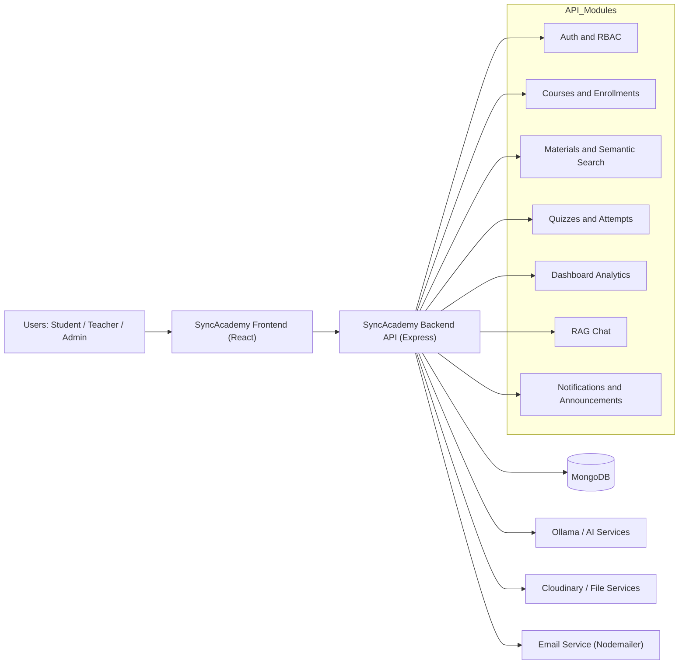
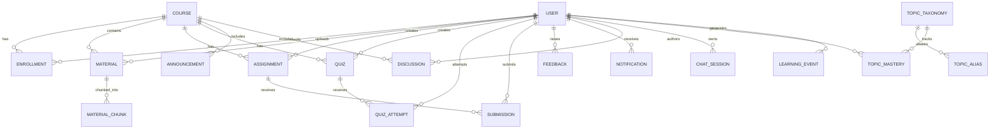
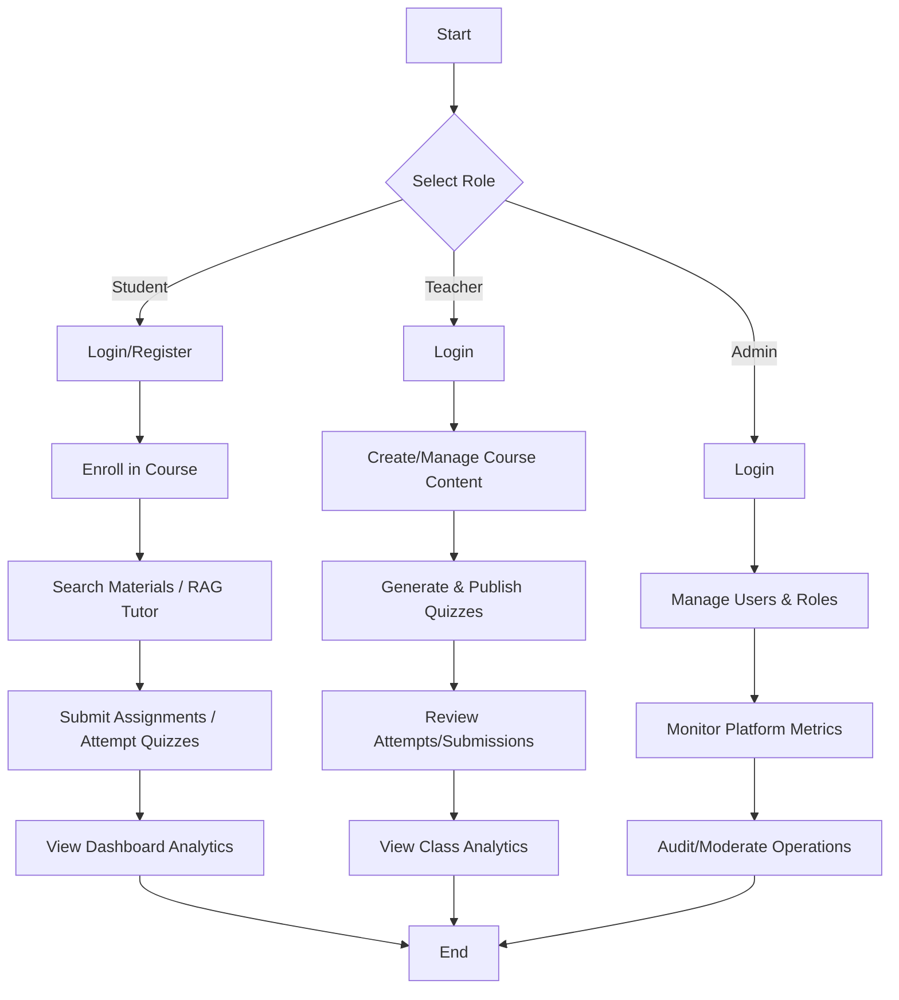
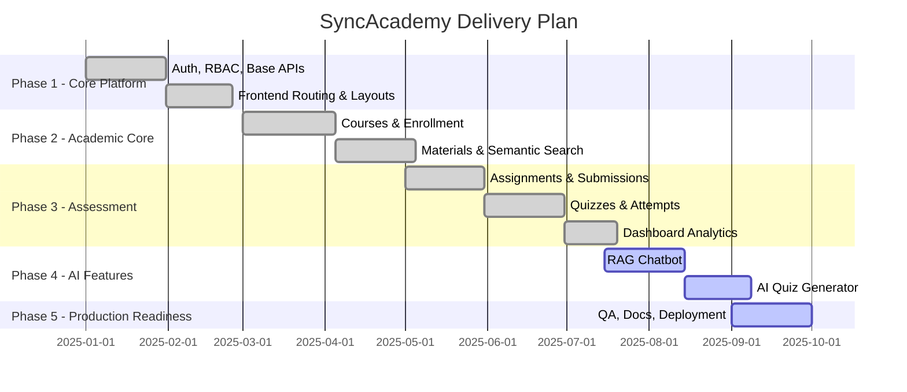

# SyncAcademy  
A modern academic platform for AI-assisted learning, analytics, and role-based course operations.


## Table of Contents
- [Executive Summary](#executive-summary)
- [Problem Statement and Goals](#problem-statement-and-goals)
- [Key Features](#key-features)
  - [Functional Features](#functional-features)
  - [Unique Engineering Features](#unique-engineering-features)
  - [Differentiators vs Typical LMS Platforms](#differentiators-vs-typical-lms-platforms)
- [System Architecture](#system-architecture)
  - [High-Level Component Overview](#high-level-component-overview)
  - [Data Flow Narrative](#data-flow-narrative)
  - [Mermaid Architecture Schema Diagram](#mermaid-architecture-schema-diagram)
- [Database Design](#database-design)
  - [Core Entities and Relationships](#core-entities-and-relationships)
  - [Normalization Assumptions](#normalization-assumptions)
  - [Mermaid ER Diagram](#mermaid-er-diagram)
- [Activity Workflows](#activity-workflows)
  - [Student Workflow](#student-workflow)
  - [Teacher Workflow](#teacher-workflow)
  - [Admin Workflow](#admin-workflow)
  - [Mermaid Activity Diagram](#mermaid-activity-diagram)
- [Project Timeline and Delivery Plan](#project-timeline-and-delivery-plan)
  - [Phases, Milestones, Deliverables](#phases-milestones-deliverables)
  - [Mermaid Gantt Chart](#mermaid-gantt-chart)
- [Tech Stack](#tech-stack)
- [Engineering Decisions and Trade-offs](#engineering-decisions-and-trade-offs)
  - [Why This Architecture](#why-this-architecture)
  - [Performance, Scalability, Security, Maintainability Considerations](#performance-scalability-security-maintainability-considerations)
- [API Overview](#api-overview)
  - [Main Route Groups](#main-route-groups)
  - [Auth Strategy](#auth-strategy)
  - [Error Handling Conventions](#error-handling-conventions)
- [Setup and Installation](#setup-and-installation)
  - [Prerequisites](#prerequisites)
  - [Local Setup (Frontend and Backend)](#local-setup-frontend-and-backend)
  - [Environment Variable Template Tables](#environment-variable-template-tables)
  - [Run, Build, Test Commands](#run-build-test-commands)
- [Deployment](#deployment)
  - [Production Setup Notes](#production-setup-notes)
  - [Frontend and Backend Hosting Details](#frontend-and-backend-hosting-details)
- [Testing and Quality Assurance](#testing-and-quality-assurance)
- [Security and Privacy](#security-and-privacy)
- [Performance and Observability](#performance-and-observability)
- [Maintenance Guide](#maintenance-guide)
  - [Repository Hygiene](#repository-hygiene)
  - [Branching Strategy](#branching-strategy)
  - [Versioning and Release Notes](#versioning-and-release-notes)
  - [Documentation Update Policy](#documentation-update-policy)
- [Roadmap](#roadmap)
- [Contribution Guidelines](#contribution-guidelines)
- [FAQ](#faq)
- [License](#license)
- [Acknowledgements](#acknowledgements)
- [Documentation Health Checklist](#documentation-health-checklist)

---

## Executive Summary

SyncAcademy is a full-stack academic platform built to support students, teachers, and administrators through AI-enabled workflows and role-based operations. It combines semantic retrieval, a RAG-based chatbot, AI quiz generation, enrollment flows, and dashboard analytics (including spider/radar-style performance views) into one integrated system.

It is designed for:
- Day-to-day learning operations (materials, assignments, quizzes, notifications)
- AI-assisted student support
- Teacher productivity and analytics
- Administrative visibility and governance

---

## Problem Statement and Goals

Many academic systems fragment core capabilities across disconnected tools (content sharing, communication, assessments, analytics). This causes poor discoverability, delayed support, and manual overhead for instructors.

**SyncAcademy goals:**
- Centralize academic workflows in one platform
- Improve learning support using RAG-based AI interactions
- Reduce teacher workload using AI quiz generation
- Enable data-informed learning through analytics dashboards
- Enforce role-based access and secure operations

---

## Key Features

### Functional Features
- Authentication and role-based authorization (student, teacher, admin)
- Course and enrollment management
- Material upload and access (PDF, DOCX, PPTX)
- Semantic search over study materials
- Assignments and submissions
- Quiz creation, publication, scheduling, and attempts
- Notifications, announcements, and discussions
- Profile and dashboard experiences for each role

### Unique Engineering Features
- RAG-based chatbot with runtime health endpoint
- AI quiz generation workflow for instructors
- Spider/radar-style analytics in dashboards
- Adaptive recommendation and knowledge-tracing related flows
- Public landing-page metrics endpoint backed by live database counts
- Automatic background cleanup and data maintenance tasks

### Differentiators vs Typical LMS Platforms
- Native AI assistant tied to internal learning resources
- Built-in quiz generation pipeline instead of manual-only authoring
- Unified platform for content, communication, analytics, and enrollment
- Multi-role workflow separation with shared core resources
- Practical engineering hooks for ML/KT experiments and reporting

---

## System Architecture

### High-Level Component Overview
- **Frontend:** React application with role-based routes and dashboard layouts
- **Backend:** Node.js + Express REST API
- **Database:** MongoDB via Mongoose
- **AI Runtime:** Ollama-hosted model integration (llama3.1 in current setup)
- **File/Asset Services:** Cloudinary support for media and file handling
- **Email Service:** Nodemailer-based notification flows

### Data Flow Narrative
1. User interacts with frontend routes (public or protected).
2. Frontend calls REST APIs through a centralized Axios client.
3. Backend validates auth token and role permissions where required.
4. Backend processes domain logic (courses, materials, quizzes, analytics, chat).
5. Data persists/retrieves from MongoDB.
6. AI features invoke retrieval/generation logic and return structured outputs.
7. UI renders role-specific dashboards and workflow states.

### Mermaid Architecture Schema Diagram



---

## Database Design

### Core Entities and Relationships

Core domain entities include:
- User (student/teacher/admin)
- Course
- Enrollment
- Material
- MaterialChunk
- Assignment
- Submission
- Quiz
- QuizAttempt
- Notification
- Announcement
- Discussion
- ChatSession
- Feedback
- Event / EventRegistration / EventMark
- TopicTaxonomy / TopicMastery / TopicAlias
- LearningEvent
- SearchHistory
- CourseInvitation

### Normalization Assumptions
- MongoDB document modeling is used with selective denormalization for read performance.
- Reference-based relationships are used for core joins (user/course/material/quiz).
- Aggregation pipelines compute analytics and dashboard summaries.
- Exact indexing strategy: **To Be Confirmed**.

### Mermaid ER Diagram



---

## Activity Workflows

### Student Workflow
- Sign up / sign in
- Enroll in courses
- Browse/search materials
- Interact with RAG tutor
- Attempt quizzes and submit assignments
- Track notifications and progress analytics

### Teacher Workflow
- Sign in and manage course assets
- Upload materials and maintain content
- Generate quizzes (AI/manual), schedule/publish
- Review attempts/submissions
- Monitor class analytics and engagement

### Admin Workflow
- Manage users and roles
- Oversee courses and governance actions
- Monitor platform usage metrics
- Resolve operational bottlenecks and feedback loops

### Mermaid Activity Diagram



---

## Project Timeline and Delivery Plan

### Phases, Milestones, Deliverables

| Phase | Focus | Milestones |
|---|---|---|
| Phase 1 | Foundation and Auth | RBAC, core routing, API baseline |
| Phase 2 | Content and Course Operations | Materials, courses, enrollment, discussions |
| Phase 3 | Assessment and Analytics | Assignments, quizzes, dashboard analytics |
| Phase 4 | AI Features | RAG chat, AI quiz generation |
| Phase 5 | Hardening and Deployment | Production rollout, docs, QA stabilization |

> Detailed historical delivery dates: **To Be Confirmed**.

### Mermaid Gantt Chart



---

## Tech Stack

| Layer | Technology |
|---|---|
| **Frontend** | React 18, React Router v6, Material UI (MUI), Axios |
| **Backend** | Node.js 18.x, Express, Mongoose, JWT + bcryptjs |
| **Database** | MongoDB |
| **AI/ML** | Ollama (llama3.1), OpenAI SDK, Python KT/training scripts |
| **File Processing** | Cloudinary, pdf-parse, mammoth, officeparser, pdfjs-dist |
| **Tooling** | Nodemon, Node test runner, React scripts |
| **Deployment** | Render (frontend + backend) |

---

## Engineering Decisions and Trade-offs

### Why This Architecture
- React + Express separation supports clear API/UI boundaries.
- REST-based modular route groups keep domain logic isolated.
- MongoDB fits evolving schema requirements for academic + AI metadata.
- Role-based middleware enforces domain-level access controls.
- AI integration is decoupled via service modules and health checks.

### Performance, Scalability, Security, Maintainability Considerations

**Performance**
- Aggregation pipelines for dashboard summaries
- Chunk-based retrieval support for RAG workflows

**Scalability**
- Modular route/service/controller organization
- Separate AI runtime endpoint support

**Security**
- JWT auth and role authorization
- Protected route groups across sensitive modules

**Maintainability**
- Domain-separated routes/controllers/services
- Scripted data ops for KT/report pipelines

> Caching strategy and SLO/SLA objectives: **To Be Confirmed**.

---

## API Overview

### Main Route Groups

| Route Group | Description |
|---|---|
| `/api/auth` | Authentication and registration |
| `/api/users` | User profile management |
| `/api/admin` | Admin operations |
| `/api/courses` | Course management |
| `/api/enrollments` | Enrollment workflows |
| `/api/materials` | Material upload and access |
| `/api/search` | Semantic search |
| `/api/assignments` | Assignments |
| `/api/quizzes` | Quiz management and attempts |
| `/api/chat` | RAG chatbot |
| `/api/notifications` | Notifications |
| `/api/announcements` | Course announcements |
| `/api/discussions` | Discussions |
| `/api/feedbacks` | Feedback management |
| `/api/events` | Events and registrations |
| `/api/stats` | Platform stats/metrics |
| `/api/course-invitations` | Course invitation flows |
| `/api/topic-tags` | Topic taxonomy |
| `/api/kt` | Knowledge tracing |
| Recommendation routes | Mounted at root-level module pathing |

### Auth Strategy
- JWT-based authentication
- Auth middleware protects private routes
- Role middleware enforces student/teacher/admin authorization

### Error Handling Conventions
- Express middleware returns JSON error payloads
- Known upload constraints mapped to user-friendly messages
- Standardized status code usage for validation/auth/resource errors

> Formal API spec (OpenAPI/Swagger): **To Be Confirmed**.

---

## Setup and Installation

### Prerequisites
- Node.js 18.x
- npm
- MongoDB connection URI
- Ollama (for chatbot runtime)
- Optional: cloud/email credentials for production integrations

### Local Setup (Frontend and Backend)

```bash
# Clone repository
git clone <repo-url>
cd Student-Aid-Semantic-Search

# Backend setup
cd backend
npm install
cp .env.example .env
npm start
```

```bash
# Frontend setup
cd ../frontend
npm install
cp .env.example .env
npm start
```

**Optional AI runtime:**

```bash
ollama serve
ollama pull llama3.1
```

### Environment Variable Template Tables

#### Backend

| Variable | Required | Example | Purpose |
|---|---|---|---|
| `MONGO_URI` | Yes | `mongodb+srv://...` | Database connection |
| `JWT_SECRET` | Yes | `long-random-secret` | JWT signing |
| `PORT` | No | `5000` | API port |
| `OLLAMA_BASE_URL` | For RAG | `http://localhost:11434` | Ollama runtime URL |
| `OLLAMA_MODEL` | For RAG | `llama3.1` | Active model |
| `CLOUDINARY_CLOUD_NAME` | Optional | `value` | File/media integration |
| `CLOUDINARY_API_KEY` | Optional | `value` | File/media integration |
| `CLOUDINARY_API_SECRET` | Optional | `value` | File/media integration |
| `OPENAI_API_KEY` | Optional | `value` | AI provider integration |
| `EMAIL_USER` | Optional | `value` | Email sender |
| `EMAIL_PASS` | Optional | `value` | Email auth |
| `FRONTEND_URL` | Recommended | `https://syncacademy.onrender.com` | Link generation in emails |
| `EMBEDDING_PROVIDER` | Optional | `huggingface` | Embedding provider |
| `HUGGINGFACE_API_KEY` | Optional | `value` | Embedding auth |
| `REDIS_URL` | Optional | `redis://127.0.0.1:6379` | Cache/message infra |

#### Frontend

| Variable | Required | Example | Purpose |
|---|---|---|---|
| `REACT_APP_LOCAL_API_BASE_URL` | Yes | `http://localhost:5000/api` | Local backend API |
| `REACT_APP_REMOTE_API_BASE_URL` | Yes | `https://student-aid-1mvg.onrender.com/api` | Remote backend API |
| `REACT_APP_API_BASE_URL` | Compatibility | `https://student-aid-1mvg.onrender.com/api` | Fallback API URL |
| `VITE_LOCAL_API_BASE_URL` | Compatibility | `http://localhost:5000/api` | Local API URL |
| `VITE_REMOTE_API_BASE_URL` | Compatibility | `https://student-aid-1mvg.onrender.com/api` | Remote API URL |
| `VITE_API_BASE_URL` | Compatibility | `https://student-aid-1mvg.onrender.com/api` | Fallback API URL |

### Run, Build, Test Commands

```bash
# Backend
cd backend
npm start
npm run test:kt
```

```bash
# Frontend
cd frontend
npm start
npm run build
npm test
```

```bash
# Selected backend data/ML scripts
cd backend
npm run topic-tags:backfill
npm run kt:features:daily
npm run kt:dataset:export
npm run kt:sequence:train
```

---

## Deployment

### Production Setup Notes
- Configure environment variables in hosting platform.
- Ensure frontend points to deployed backend API.
- Configure SPA refresh rewrites for frontend hosting.
- Validate CORS and `FRONTEND_URL` values for email links and browser flows.

### Frontend and Backend Hosting Details

| Service | URL |
|---|---|
| Frontend | https://syncacademy.onrender.com |
| Backend | https://student-aid-1mvg.onrender.com |

> CI/CD pipeline specifics: **To Be Confirmed**.

---

## Testing and Quality Assurance

- Frontend tests via React testing libraries and `react-scripts test` command.
- Backend includes Node test runner scripts for KT-related modules.
- Build-time lint warnings currently surface during frontend production build.

**Recommended QA gates:**
- Passing backend tests
- Frontend build success
- Smoke test of role-based routes
- API health checks (including `/api/chat/health`)

> Coverage thresholds and required quality gates: **To Be Confirmed**.

---

## Security and Privacy

- JWT authentication with protected API middleware
- Role-based authorization for sensitive operations
- Input validation and upload constraints in API layer
- Separation of environment-based secrets from source code

> Production secret rotation policy: **To Be Confirmed**  
> Privacy/compliance framework (FERPA/GDPR/etc.): **To Be Confirmed**

---

## Performance and Observability

- Aggregation-driven analytics endpoints for dashboard efficiency
- AI health endpoint for runtime availability checks
- Background cleanup tasks for operational hygiene

> Current observability stack (central logs/APM/tracing): **To Be Confirmed**

**Recommended next steps:**
- Structured logging
- Request latency tracking
- Error budget/SLO definition
- Dashboarding for API and AI runtime health

---

## Maintenance Guide

### Repository Hygiene
- Keep domain modules isolated by route/controller/service/model boundaries.
- Avoid cross-domain coupling in controllers.
- Keep environment templates synchronized with runtime expectations.
- Update README whenever routes/features/env vars change.

### Branching Strategy

> **To Be Confirmed**

Suggested baseline:
- `main` — production
- `develop` — integration
- `feature/*` — short-lived changes
- `hotfix/*` — urgent production fixes

### Versioning and Release Notes
- Current package versions indicate initial product maturity.
- Recommended: semantic versioning (`MAJOR.MINOR.PATCH`) and CHANGELOG maintenance.
- Release note template: **To Be Confirmed**.

### Documentation Update Policy

Update README in the same PR whenever:
- API contract changes
- Env var changes
- New AI/analytics behavior is introduced
- Deployment behavior changes

---

## Roadmap

**Short-term:**
- Formalize API documentation (OpenAPI)
- Improve frontend lint compliance and warning reduction
- Add end-to-end smoke tests per role

**Long-term:**
- Advanced personalization and recommendation tuning
- More robust observability and alerting
- Scalable background job architecture
- Expanded analytics and reporting exports
- Multi-tenant or institution-level configuration support

---

## Contribution Guidelines

1. Fork and create a feature branch.
2. Keep PR scope focused and testable.
3. Add or update tests where applicable.
4. Ensure frontend build and backend tests pass locally.
5. Update docs for behavior/config changes.
6. Submit PR with clear problem statement, design summary, and validation evidence.

> Contribution governance model: **To Be Confirmed**.

---

## FAQ

**Q: Does SyncAcademy support AI chat?**  
Yes. It includes a RAG-based chatbot pipeline and a health endpoint for runtime checks.

**Q: Which roles are supported?**  
Student, teacher, and admin with role-based route and API permissions.

**Q: Can quizzes be generated with AI?**  
Yes. Teacher/admin quiz generation workflows are available.

**Q: Is course enrollment supported?**  
Yes. Enrollment routes and role-based course participation workflows are included.

**Q: What is required to run AI locally?**  
Ollama runtime plus llama3.1 model availability.

---

## License

**To Be Confirmed**

---

## Acknowledgements

- Open-source ecosystem maintainers for React, Express, MongoDB, MUI, and related libraries
- AI tooling community around retrieval and local model orchestration
- Project contributors, testers, and reviewers

---

## Documentation Health Checklist

- [ ] Setup verified
- [x] Env vars documented
- [ ] API updated
- [x] Diagrams updated
- [ ] Changelog updated
- [ ] Last reviewed date: 2026-04-24
