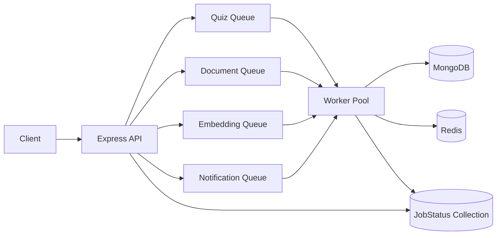
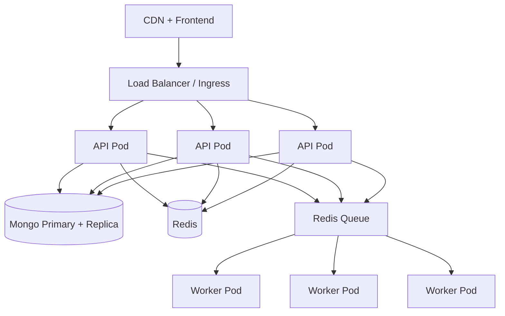
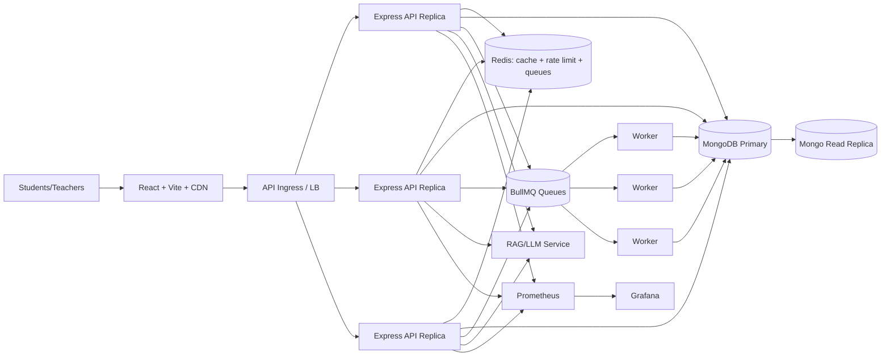

# LMS High-Scale Implementation Plan (2000+ Concurrent Users)

This document maps implemented code to an operational scale plan.

## SLO Targets
- Concurrent users: 2000+
- API latency: p95 < 400ms (core endpoints)
- Error rate: < 1%
- Quiz submission: exactly-once semantics via idempotency + uniqueness + lock
- Data integrity: no duplicate attempts, no stale write corruption

## Phase 1 - Capacity Planning and Observability

### Architectural goal
Create production visibility for latency, error rate, queue throughput, and saturation.

### Why this is necessary
Without measured baselines and SLO signals, tuning for scale is guesswork.

### Concrete implementation tasks
- Added Prometheus metrics in `backend/observability/metrics.js`.
- Added request timing and request counters in `backend/middleware/observabilityMiddleware.js`.
- Added structured logging via Pino in `backend/observability/logger.js`.
- Added OTEL tracing bootstrap in `backend/observability/tracing.js`.
- Added ops endpoints in `backend/routes/opsRoutes.js`:
  - `GET /ops/healthz`
  - `GET /ops/readyz`
  - `GET /ops/metrics`
- Added Prometheus and Grafana provisioning:
  - `infra/monitoring/prometheus/prometheus.yml`
  - `infra/monitoring/grafana/provisioning/**`

### Folder/service structure
- `backend/observability/*`
- `backend/middleware/observabilityMiddleware.js`
- `backend/routes/opsRoutes.js`
- `infra/monitoring/*`

### Example snippet
```js
// backend/middleware/observabilityMiddleware.js
httpRequestDurationMs.observe({ method: req.method, route, status_code: String(res.statusCode) }, durationMs);
httpRequestsTotal.inc({ method: req.method, route, status_code: String(res.statusCode) }, 1);
```

### Deployment considerations
- Expose `/ops/metrics` only internally.
- Scrape every 15s.
- Dashboard alert examples:
  - p95 latency > 400ms for 5m
  - error rate > 1% for 5m

## Phase 2 - Backend Performance Quick Wins

### Architectural goal
Reduce per-request CPU/IO and protect APIs under burst traffic.

### Why this is necessary
Most scale failures are from avoidable synchronous work and unbounded request fan-in.

### Concrete implementation tasks
- Stateless API process + trust proxy + hardened middleware in `backend/app.js`.
- Added Redis client `backend/config/redis.js`.
- Added API cache middleware `backend/middleware/cacheMiddleware.js`.
- Added rate limiting and throttling middleware `backend/middleware/rateLimitMiddleware.js`.
- Enabled HTTP compression + helmet in `backend/app.js`.
- Enabled response caching on high-read routes:
  - `backend/routes/materialRoutes.js`
  - `backend/routes/searchRoutes.js`
  - `backend/routes/notificationRoutes.js`
  - `backend/routes/quizRoutes.js`
- Added Redis-backed POST search result cache in `backend/controllers/searchController.js`.
- Added Mongo pool tuning in `backend/config/db.js`.

### Folder/service structure
- `backend/config/redis.js`
- `backend/middleware/cacheMiddleware.js`
- `backend/middleware/rateLimitMiddleware.js`
- `backend/app.js`

### Example snippet
```js
// backend/middleware/cacheMiddleware.js
const key = `api:${req.user?._id || "anon"}:${req.originalUrl}`;
const cached = await redis.get(key);
if (cached) return res.json(JSON.parse(cached));
```

### Deployment considerations
- Use managed Redis in production.
- Start conservative limits and tune with live metrics.

## Phase 3 - Background Job Processing

### Architectural goal
Move expensive operations off the request path to async workers.

### Why this is necessary
Synchronous heavy tasks increase tail latency and collapse throughput under concurrency.

### Concrete implementation tasks
- Added BullMQ queues:
  - `backend/queues/index.js`
  - `backend/queues/jobProducer.js`
  - `backend/queues/queueNames.js`
- Added job status tracking model `backend/models/jobStatusModel.js`.
- Added workers and processors:
  - `backend/workers/index.js`
  - `backend/workers/processors/quizGenerationProcessor.js`
  - `backend/workers/processors/documentParsingProcessor.js`
  - `backend/workers/processors/embeddingProcessor.js`
  - `backend/workers/processors/notificationProcessor.js`
- Added job status APIs:
  - `backend/routes/jobRoutes.js`
  - `backend/controllers/jobController.js`
- Wired async quiz generation in `backend/controllers/quizController.js`.
- Wired async material parsing/embedding in `backend/controllers/materialController.js`.
- Wired async notification fan-out in `backend/utils/notificationHelper.js`.

### Queue architecture diagram


### Example snippet
```js
// backend/controllers/quizController.js
await JobStatus.create({ jobId, queue: QUEUE_NAMES.QUIZ_GENERATION, state: "queued", payload, requestedBy: req.user._id });
await enqueueQuizGenerationJob(payload);
return res.status(202).json({ message: "Quiz generation has been queued", jobId });
```

### Deployment considerations
- Scale workers independently from API replicas.
- Alert on queue depth and failed job rate.

## Phase 4 - Containerization and Horizontal Scaling

### Architectural goal
Package API and workers for independent horizontal scaling.

### Why this is necessary
Containerized stateless services enable autoscaling and safe rollouts.

### Concrete implementation tasks
- Added backend container images:
  - `backend/Dockerfile`
  - `backend/Dockerfile.worker`
- Added local stack orchestration:
  - `infra/docker-compose.yml`
- Added K8s manifests with HPAs:
  - `infra/k8s/backend-deployment.yaml`
  - `infra/k8s/worker-deployment.yaml`

### Service architecture diagram


### Example snippet
```yaml
# infra/k8s/backend-deployment.yaml
spec:
  replicas: 3
  template:
    spec:
      containers:
        - name: backend
          resources:
            requests: { cpu: "250m", memory: "512Mi" }
```

### Deployment considerations
- Use rolling updates with readiness probes.
- Keep worker and API autoscaling policies separate.

## Phase 5 - Database Scaling Strategy

### Architectural goal
Optimize read/write paths for high concurrency while preserving consistency.

### Why this is necessary
Poor indexes and pool defaults produce lock contention and high p95 latency.

### Concrete implementation tasks
- Added/extended indexes in:
  - `backend/models/materialModel.js`
  - `backend/models/quizModel.js`
  - `backend/models/enrollmentModel.js`
  - `backend/models/chatSessionModel.js`
  - `backend/models/materialChunkModel.js`
  - `backend/models/courseModel.js`
- Added Mongo connection pool tuning in `backend/config/db.js`.
- Added pagination hardening for attempts in `backend/controllers/quizController.js`.

### Avoid N+1 queries
- Use `populate` only on required fields.
- Fetch child aggregates in batch (already used in quiz attempt count aggregation).
- Return projections (`select`) for list views.

### Archival pattern
- Move old notifications/search-history/chat messages to archive collections with TTL or scheduled jobs.

## Phase 6 - RAG / AI Chat Scaling

### Architectural goal
Stabilize chat under load and isolate model volatility from core LMS flows.

### Why this is necessary
LLM latency spikes and transient failures can saturate API workers.

### Concrete implementation tasks
- Added timeout/retry/circuit-breaker utilities:
  - `backend/utils/asyncResilience.js`
  - `backend/services/circuitBreaker.js`
- Wired resilient chat execution in `backend/controllers/chatController.js`.
- Added async embedding processing pipeline via worker processors.

### Example snippet
```js
const { answer } = await retryWithBackoff(
  () => withTimeout(ragChat(message.trim(), chatHistory, filters), 20000, "RAG processing timed out"),
  1,
  400
);
```

### Ollama local vs managed inference
- Local Ollama limits:
  - constrained concurrency per GPU/CPU host
  - unstable p95 during spikes
  - difficult autoscaling
- Managed model APIs:
  - elastic scaling
  - better SLA
  - simpler multi-region failover

## Phase 7 - Reliability and Data Safety

### Architectural goal
Guarantee safe writes for quizzes and degrade gracefully when dependencies fail.

### Why this is necessary
At scale, retries and duplicated requests are normal; write paths must be idempotent.

### Concrete implementation tasks
- Added idempotency middleware:
  - `backend/middleware/idempotencyMiddleware.js`
- Enforced idempotency on quiz submit route:
  - `backend/routes/quizRoutes.js`
- Added distributed lock for attempt creation:
  - `backend/controllers/quizController.js`
- Added graceful startup/shutdown and non-fatal Redis startup fallback:
  - `backend/server.js`, `backend/config/redis.js`

### Example snippet
```js
await withDistributedLock(`lock:quiz-attempt:${quiz._id}:student:${req.user._id}`, 10000, async () =>
  QuizAttempt.create({...})
);
```

### Deployment considerations
- Use blue/green or canary deployment strategy in CI/CD.
- Start canary at 5%, then 25%, 50%, 100% based on SLO health.

## Phase 8 - Load Testing and Production Readiness

### Architectural goal
Validate behavior at 100, 500, 1000, and 2000 concurrent users.

### Why this is necessary
Scale assumptions must be validated by controlled traffic profiles.

### Concrete implementation tasks
- Added k6 scripts:
  - `infra/loadtest/k6/quiz-traffic.js`
  - `infra/loadtest/k6/chat-traffic.js`
- Added load test runbook:
  - `infra/loadtest/README.md`

### Example snippet
```js
export const options = {
  thresholds: {
    http_req_failed: ["rate<0.01"],
    http_req_duration: ["p(95)<400"],
  },
};
```

### Bottleneck detection checklist
- p95 latency rising with stable CPU: likely DB or external IO bottleneck.
- Queue lag growing: increase worker count or optimize job cost.
- Redis misses high: review cache keys and TTL by endpoint.

## Complete Production Architecture Diagram


## Recommended Folder Structure
```text
backend/
  app.js
  server.js
  config/
    db.js
    redis.js
  observability/
    logger.js
    metrics.js
    tracing.js
  middleware/
    observabilityMiddleware.js
    rateLimitMiddleware.js
    cacheMiddleware.js
    idempotencyMiddleware.js
  queues/
    connection.js
    queueNames.js
    index.js
    jobProducer.js
  workers/
    index.js
    processors/
      quizGenerationProcessor.js
      documentParsingProcessor.js
      embeddingProcessor.js
      notificationProcessor.js
  models/
    jobStatusModel.js
```

## 30-Day Implementation Roadmap
- Days 1-4: Deploy observability stack, baseline load tests at 100 users.
- Days 5-9: Tune rate limits, cache policies, DB pools and indexes.
- Days 10-15: Move heavy APIs to queues, verify job retries and failure handling.
- Days 16-20: Container hardening, deploy HPA for API and workers.
- Days 21-25: RAG resilience and fallback validation, test circuit breaker behavior.
- Days 26-30: Full load tests to 2000 users, bottleneck remediation, canary rollout.

## Scaling Checklist Before Launch
- [ ] p95 < 400ms for auth, quiz list, submission, notifications
- [ ] error rate < 1% under 2000-user test
- [ ] idempotent quiz submit validated under retry storm
- [ ] queue failure and retry paths validated
- [ ] cache hit ratio > 60% on read-heavy endpoints
- [ ] dashboard and alerts active for SLOs
- [ ] HPA policies verified for API and workers
- [ ] backup/restore test completed for MongoDB
- [ ] blue/green or canary playbook tested
